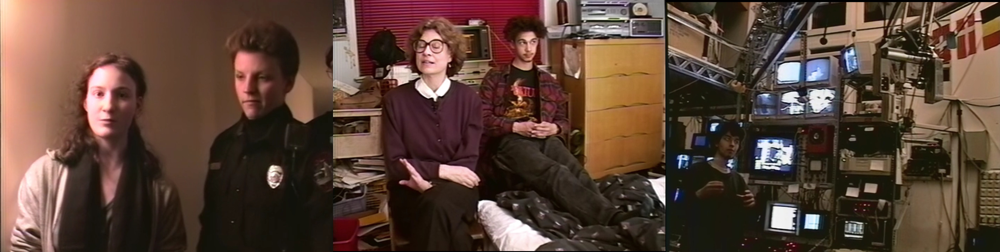
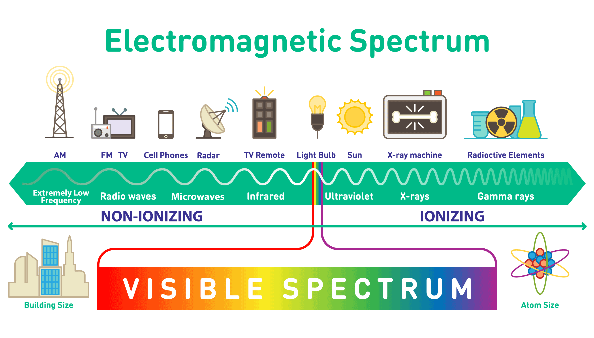
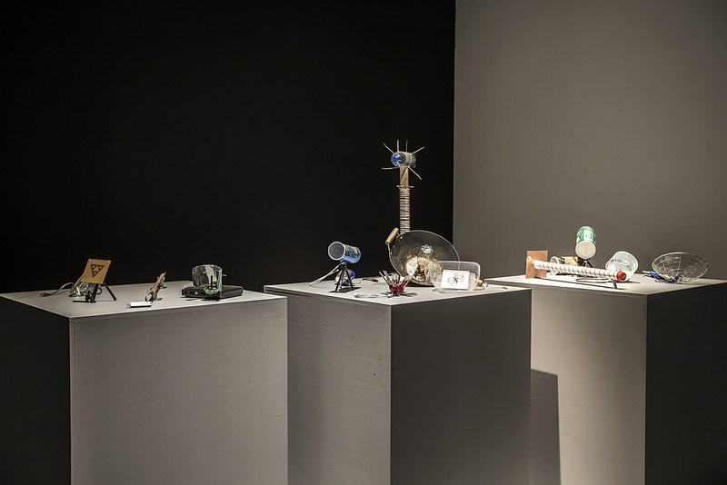
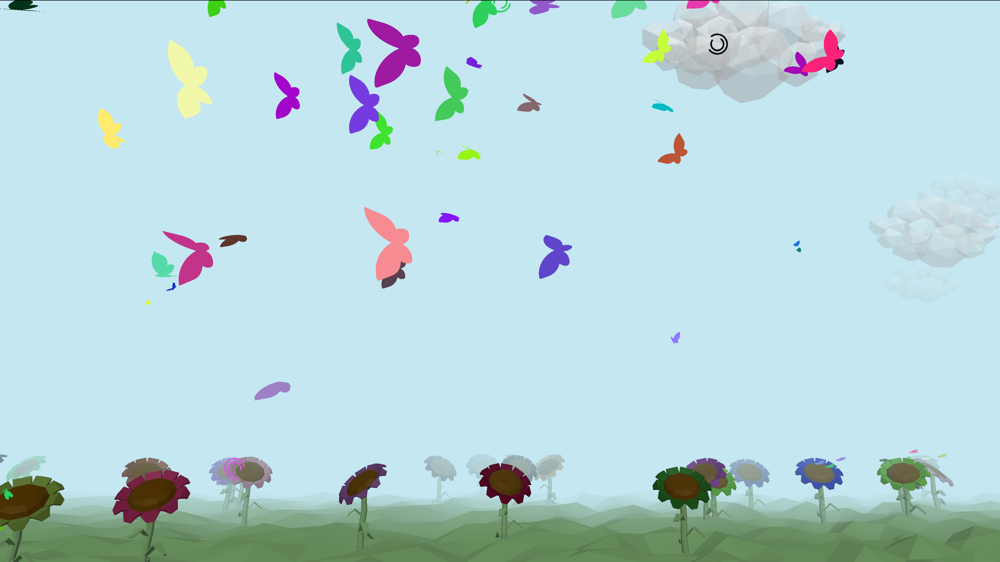
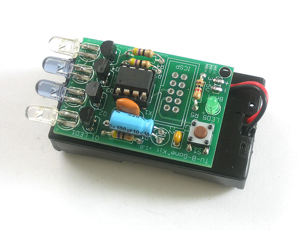
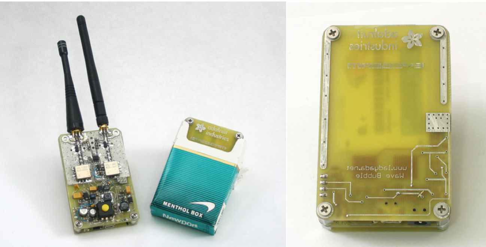
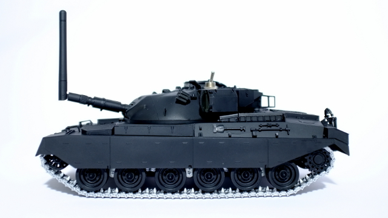
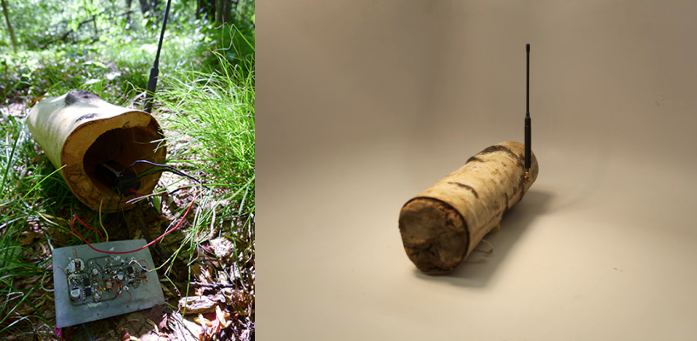

# WiFi H4X0Rz

## Unauthorized Access

[Aunauthorized Access](https://archive.org/details/UnauthorizedAccess): "using new technologies in a way which is not intended." -- unnamed German hacker. this documentary is a gem! A doc made in 1994 by Annaliza Savage, she traveled to 15 cities in four countries to record the stories of notorious hackers and hacker culture) in that era. Not the DIY home-brew tinkier sort of hacker (like the kind you'd find at a Hack-a-thon or maker space) but the "black hoodie" breaking into systems sort of hacker. Though illegal, this was a time before the "[Cyberwar](https://www.viceland.com/en_us/show/cyberwar)" era we're in now, most of these hackers weren't paid, they weren't after money, they did what they did either for political/activist reasons, or for the challenge, or sometimes just for fun.

## WiFi

[the Electromagnetic Spectrum](https://en.wikipedia.org/wiki/Electromagnetic_spectrum)

[Pretty Fly for a WiFi](https://www.roelof.info/pretty-fly-for-a-wi-fi.html) by Roel Roscam Abbing

[WiFi Data Safari](https://player.vimeo.com/video/269679739?color=ff0179&title=0&byline=0&portrait=0&autoplay=1&loop=1) by Branger_Briz (Nick Briz and Brannon Dorsey)

## jammers

TV-B-Gone by [Mitch Altman](https://en.wikipedia.org/wiki/Mitch_Altman)

Wave Bubble by [Limor Fried](https://en.wikipedia.org/wiki/Limor_Fried) (aka ladyada of [Adafruit](https://www.adafruit.com/))

No Network by [Julian Oliver](https://julianoliver.com/)

Log Jammer by [Allison Burtch](https://allisonburtch.github.io/)
