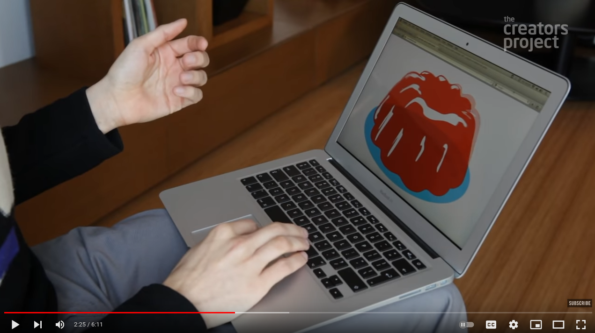
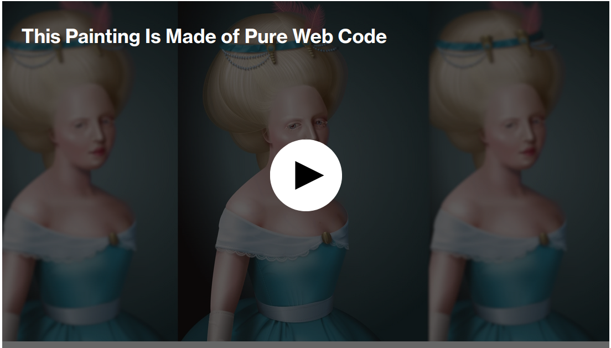

# Internet Art

### net.art

[Net Art at the Whitney Museum](https://www.youtube.com/watch?v=e1ehF1tOoaA)

### Post-Internet

AIDS-3D’s OMG Obelisk in the New Museum Triennial

[Is Yung Jake The Internet’s Artist?](https://www.youtube.com/watch?v=MBPvLMfiSJU)

### Web Based Internet Art

Rafaël Rozendaal [Turning The Internet Into An Art Gallery](https://www.youtube.com/watch?v=q2PlTV-RvnE)

### "outsider art"

[This Stunning Image Made With Pure Code Is Like a Mood Ring For Your Browser](https://www.vice.com/en/article/9kgx7p/painting-made-with-code-html-pure-css-browser-art-diana-smith)
